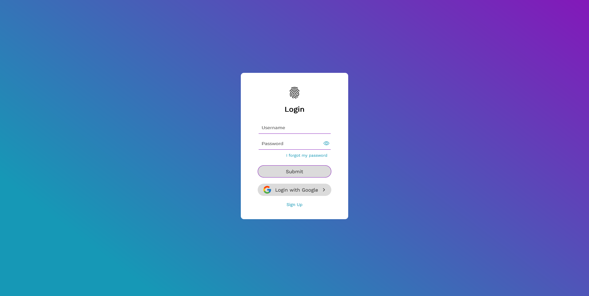

# LOGIN FORM 

This is a free and design focus login form with HTML and CSS.

## Overview

### The project

Users should be able to provide info easy and fast; and also, see view the optimal layout for the site depending on their device's screen size.

Recent updates includes:

- Show and Hide password functionality.

- Spinner loader animation.

- Login option using Google.

### Screenshot

Below you can see a screenshot of the final result. (the image has been updated)

### Links

- Repository URL: [Click here to check it out](https://github.com/GregoriM04/login-form.git)
- Live server URL: [Click here to check it out](https://gregorim04.github.io/login-form/)

## Process

### Built with

- Semantic HTML5 markup
- CSS custom properties
- Flexbox
- Mobile-first workflow

## Author

- LinkedIn - [Gregori Martinez](https://www.linkedin.com/in/gregorim04/)
- Twitter - [@GregoriM04](https://twitter.com/GregoriM04)